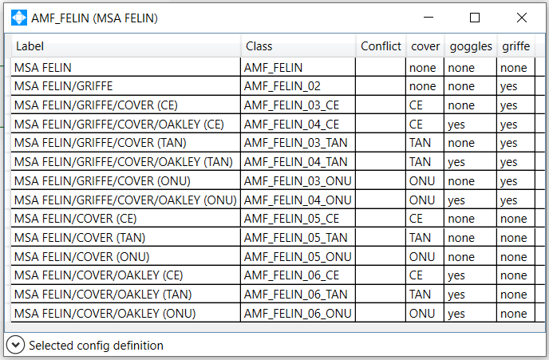
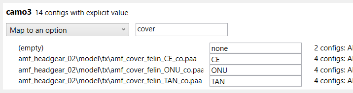
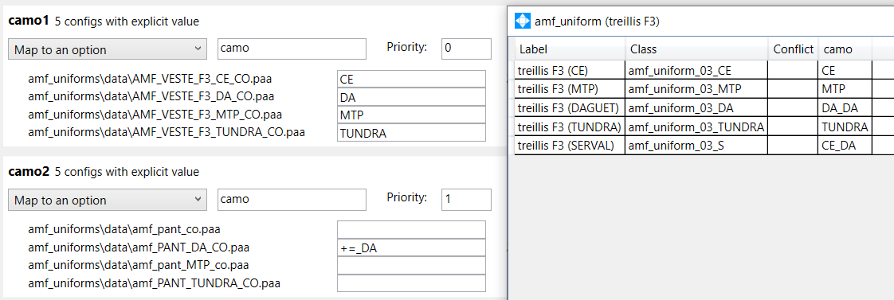
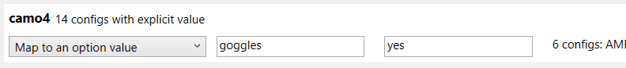

# ACE Arsenal Extended Config Helper

The **Config Helper Application** is a tool designed to generate ACEAX configuration from an existing mod. 

It analyzes mod configuration files to detect Arsenal entries that have the same 3D model but different textures. 

It allows to "map" a texture slot (=hiddenselection) to an option, and each actual texture to a value of that option.

## Step 1 : Get mod configuration files

### Non obfuscated PBO

If the mod PBO are not obfuscated, you will be able to directly use PBO files of the mod in the tool.

### Obfuscated PBO

Otherwise, you will have to extract the configuration file hidden in the PBO. 
  - You can use my [PBO Explorer tool](https://github.com/jetelain/PboExplorer),
    1. Look at `config.cpp` to identify data file (For example, `#include ...xà*ùџ.ogg..` means config is hidden in `xà*ùџ.ogg`, some invalid caracters may appears in the name, but they have to be ignored)
    2. Extract the file you found in `config.cpp` (`xà*ùџ.ogg` according to previous example) to `name_of_the_pbo.cpp` into a dedicated directory
  - You can also dump configuration in-game using a script.

## Step 2 : Launch tool and load configuration files

Launch the tool, in the menu "File" go to "Open config file...", then select all wanted files (non obfuscated PBO, BIN or CPP files).

If you load CPP files, or use a PBO with cpp files, you will need to have Arma3 Tools installed to allow the tool to parse config files.

Tool will parse files and show you an automatic mapping. 

Current version automatic mapping is based on USP conventions and may generate completly wrong suggestions for other mods or vanilla content.

## Step 3 : Map configuration

### Preview result

You can click on button "Show configs" to preview options values per arsenal entry.

### Map to an option

Choose "Map to an option", to map a texture slot/hiddenselection to an option.
The first input field gives the option name. Then an input field for each texture is available to set the option value.

The same option name can used by multiple texture slot/hiddenselection. 
A priority input field will help you to choose in wich order values are processed.
If value overlaps due to combinaisons, you can use the `+=` syntax. 

### Map to an option value

Choose "Map to an option value", to map a texture slot/hiddenselection to an option value when it's not empty.
If the texture slot/hiddenselection have non empty value, the option will be set to the second input field.

You can also here use the `+=` syntax.

### Ignore

Some texture slots/hiddenselections might not be relevant. It can be ignored with the appropriate value from the dropdown list.

Some texture values might also not be relevant, clear the value field to ignore it.

### Multiple 3D models to a single ACEAX model

By default, an ACEAX model is proposed for a single 3D model/P3D. 

You can map multiple 3D model/P3D to a single ACEAX model. The automatic mapping might also propose you to do so.

Choose the same model name in the appropriate text box.

You should create a manual option to be able to make the difference between the differents 3D models/PD3s. Click on "Add on option" on one of the model.

You will have to set options values at 3D models/PD3s level for options that may not exists within.

## Step 4 : Resolve conflicts

Conflicts may appears if options overlaps. Click in "Conflicts" menu to show conflicts per ACEAX model.

Get back to step 3 to change mapping to avoid conflicts.

## Step 5 : Generate config

One your mapping is ready, you can go in the menu "File", then "Generate config to a directory...", choose a file (name is not usued, only directory).

It will generated :
  - `config.cpp` if missing
  - `XtdGearInfos.hpp`
  - `XtdGearInfos`
    - config file name
      - `CfgVehicles`, `CfgWeapons`, `CfgGlasses`
        - `ModelName.hpp`
  - `XtdGearModels_Common.hpp` if missing
  - `XtdGearModels.hpp`
  - `XtdGearModels`
    - config file name
      - `CfgVehicles`, `CfgWeapons`, `CfgGlasses`
        - `ModelName.hpp`

This configuration should be "ready to use" with your favorite addon building tool.

## Step 6 : Customize config

You can edit `XtdGearModels_Common.hpp` and `config.cpp` to add or change anything you want. Thoses files are kept as-is by the generator.

You can also edit `XtdGearModels/**/*.hpp` files to :
- customize model and options properties
- add texture options

Generation process is incremental, and will keep most of your edits made in thoses files.

For long term use you should use a versionning tool such as git to keep track of changes, and check generation results.

## Step 7 : Backup your `aceax.json`

All mapping options are persisted in `aceax.json` file stored in the same directory of loaded mod config files (it's saved on the fly as you edit in the UI). It's recommanded to backup this file once you have acheived the correct mapping.
