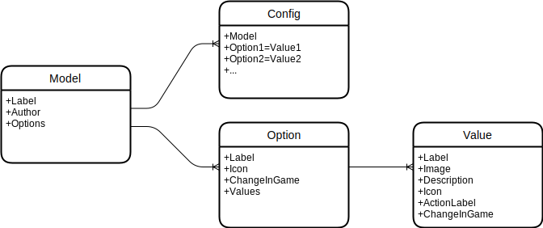

# ACE3 Arsenal Extended
Find easily your favorite gear within [ACE3 Arsenal](https://ace3mod.com/)

Based on an original idea of Krogar from [Arma Mod France](https://discord.gg/uPY7uE9) and [UnderSiege Productions](https://uspmod.com/)

## For users

Install mod from Steam Workshop 
- [For USP AIO](https://steamcommunity.com/sharedfiles/filedetails/?id=2522642015)
- [For AMF AIO](https://steamcommunity.com/sharedfiles/filedetails/?id=2522640148)
- [For Australian Commandos Weapon Pack](https://steamcommunity.com/sharedfiles/filedetails/?id=2689711987)

### ACE Arsenal

### Ingame self-actions

## For mission creators

### 3DEN Editor

ACE3 Arsenal Extended is also now available in 3DEN Editor. 

An additional property "Texture options (ACE Arsenal Extended)" is available. This property is used by Arsenal to store "texture options" that would be otherwise lost. 
This property is an array of key-value pairs `[["model_option","value"], ...]`, example : `[["USP_G3C_pantscamo","M81"]]`.

## For mod creators

### Modelisation

- The root object is "Model".
- Each "Model", has one or more "Options".
- Each "Option", has multiple "Values".
- Each "Model", has one unique "Config" for a combinaison of "Value" per "Option".



All these objets are found in Arma 3 configuration :
- A "Config" is a class in `CfgWeapons`/`CfgGlasses`/`CfgVehicle`, that have a `XtdGearInfo` subclass or that have a class with the same name in `XtdGearModels >> CfgWeapons`/`CfgGlasses`/`CfgVehicle`.
- A "Model", in a class in `XtdGearModels >> CfgWeapons`/`CfgGlasses`/`CfgVehicle`.
- An "Option" is a class within a "Model", with it's name referenced in `options` property.
- A "Value" is a class within a "Option", with it's name referenced in `values` property.

"Options" and "Values" may have conventional names, referenced in `XtdGearModels >> Conventional`. This allow to inherit values, without real inheritance to avoid creating a dependency to this mod. See [addons/gearinfo/XtdGearModels.hpp](addons/gearinfo/XtdGearModels.hpp) for existing names and options.

### Sample

```c++
class XtdGearModels
{
    class CfgWeapons 
    {
        class my_model
        {
            label = "Model label";
            author = "My name";
            options[] = {"camo","optionA"};
            class camo // coventional name
            {
                values[] = {"MTP", "Tropic"};
                // all values already exists, no need to create subentries
            };
            class optionA
            {
                label = "Option A label";
                values[] = {"value1", "value2"};
                changeingame = 0; // 1 if value can be changed in game via ACE menu
                // changedelay = 2; If can changeingame, wait delay before change is effective (can be 0, 0.1, or more)
                // icon = "xxx"; If can changeingame, action group icon in ACE menu
                class value1
                {
                    label = "1";
                    description = "Value 1 for option A"; // displayed as tooltip
                    // image = "xxx"; Background image in Arsenal
                    // icon = "xxx"; If can changeingame, action icon in ACE menu
                    // actionlabel = "xxx"; If can changeingame, action label in ACE menu
                    // itemingame = "xxx"; If can changeingame, requires this item to be present in inventory. Item will be removed from inventory (added back if an other value is choosen)
                    // changedelay = (inherited by default); If can changeingame, wait delay before change is effective
                };
                class value2
                {
                    label = "2";
                };
            };
        };
    };
};
class CfgWeapons 
{
    class baseClass;
    class my_model_MTP_value1 : baseClass // you can use any name
    {
        class XtdGearInfo
        {
            model = "my_model"; // class name in XtdGearModels >> CfgWeapons
            camo = "MTP";
            optionA = "value1";
        };
        // ...
    };
    // ...
};
```

Alternative syntax to avoid impacting `CfgWeapons`/`CfgGlasses`/`CfgVehicle` :

```c++
class XtdGearModels
{
    // identical to previous sample
};
class XtdGearInfos
{
    class CfgWeapons 
    {
        class my_model_MTP_value1 // exact class name in CfgWeapons (case sensitive !)
        {
            model = "my_model"; // class name in XtdGearModels >> CfgWeapons
            camo = "MTP";
            optionA = "value1";
        };
        // ...
    };
};
```

### Texture Options

On uniforms and backback, you can add special options called "texture options". Those options will not change the "Config", but will allow you to change a texture of an hiddenselection defined in the "Config". 

Those options are listed in the `textureOptions` array in the "Model". 
Options are defined like all others options with an additional string or number `hiddenselection`. 
"Values" have an additional string `texture`.

Texture options does not yet support `changeingame`.

```c++
class XtdGearModels
{
    class CfgWeapons 
    {
        class my_model
        {
            // ...
            textureOptions = { "bloodtype" };
            class bloodtype
            {
                label = "Blood type";
                values[] = {"A", "B", "AB", "O"};
                hiddenselection = "selectionName";
                class A
                {
                    texture = "path\to\texture.paa";
                    // material = "path\to\material.rvmat"; (if you use material on an option, you MUST set it on all options to avoid undefined behavior)
                };
                // ...
            };
        };
    };
};
class CfgWeapons 
{
    class baseClass;
    class my_model_MTP_value1 : baseClass
    {
        class XtdGearInfo
        {
            model = "my_model";
            // ...
        };
        hiddenselections = { /*..., */ "selectionName" };
        // ...
    };
    // ...
};
```

A texture option may impact multiple hidden selections. Instead of `hiddenselection` + `texture`, specify `hiddenselections` + `textures`.

```c++
class XtdGearModels
{
    class CfgWeapons 
    {
        class my_model
        {
            // ...
            textureOptions = { "bloodtype" };
            class bloodtype
            {
                label = "Blood type";
                values[] = {"A", "B", "AB", "O"};
                hiddenselections[] = { "selectionName1", "selectionName2" };
                class A
                {
                    textures[] = { "path\to\texture.paa", "" };
                    // materials[] = { "path\to\material.rvmat", "" }; (if you use material on an option, you MUST set it on all options to avoid undefined behavior)
                };
                class B
                {
                    textures[] = { "", "path\to\texture.paa" };
                    // materials[] = { "", "path\to\material.rvmat" }; 
                };
                class AB
                {
                    textures[] = { "path\to\texture.paa", "path\to\texture.paa" };
                    // materials[] = { "path\to\material.rvmat", "path\to\material.rvmat" }; 
                };
                // ...
            };
        };
    };
};
```

### The bluit-in approach

You can builtin configuration for ACE3 Arsenal Extended within your mod, without creating a dependency. You may duplicate all what you need, or use conventional names.

### The compat mod approach

You can also build a compat addon that overrides entries in `CfgWeapons`/`CfgGlasses`/`CfgVehicle` to add required informations.

### The all-in-one ACEAX mod approach

You can also add data to the ACEAX mod in `XtdGearInfos` to extends a mod without creating a direct dependency on it (Pull-Request are welcome !).

## How to build ?

Download the incredible [HEMTT](https://github.com/BrettMayson/HEMTT) tool by  [BrettMayson](https://github.com/BrettMayson).

Place hemtt.exe at the project root, and launch `.\hemtt.exe build`

## License

Arsenal integration is under [GNU GPL v2 License](addons/arsenal/LICENSE). Other parts are under the [MIT License](addons/gearinfo/LICENSE).

It includes sources files from [CBA_A3](https://github.com/CBATeam/CBA_A3/) (script_macros_common.hpp) and [ACE3](https://github.com/acemod/ACE3/) (defines.hpp).
